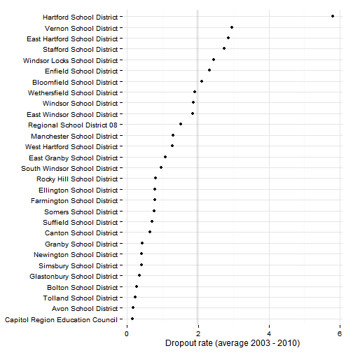

## Data and limitations

Dropout rates in Connecticut are [reported by SDE](http://sdeportal.ct.gov/Cedar/WEB/ct_report/DropoutDT.aspx). The Census Bureau reports data on the percent of adults without a high-school degree, but does not directly report dropouts. 

The most current data from SDE is three years old - for 2010 - although data is available back to 2003-04. (Cumulative dropout rates are only published through 2008.)

## What do we already know?

Below are references for some local, regional and national reports that use dropout rates, with some details on how the data is used. 

### Local

* [Health Equity Index](http://www.cadh.org/health-equity/health-equity-index.html): CADH's health equity index includes cumulative (four-year) dropout rates in the 'Education' domain, but the [health needs assessment for Hartford](http://hhs.hartford.gov/Shared%20Documents/Community%20health%20needs%20assessment%202012.pdf) from 2012 does not directly reference dropout rates. 
* [CT Voices for Children](http://www.ctvoices.org/) plans to include dropout rates in reports for the region which will be released in the coming months. 

### Other relevant efforts

* [Boston Indicators Project](http://www.bostonindicators.org/): The [most recent report](http://www.bostonindicators.org/~/media/Files/IndicatorsReports/Reports/Indicator%20Reports/Indicators2012.pdf) mostly covers wages and employment for high school dropouts in the workforce and does not look at dropout rates directly.
* [What Matters to Metros](http://www.thefundneo.org/what-matters/what-matters-metros) is a project looking at economic competitiveness via a funder's collaborative in Northeast Ohio. Their model includes dropout rates as one factor. 
* [The Declaration Initiative](http://15th-www.declarationinitiative.org/poverty-in-america/6-deadly-poverty-trap-triggers) identifies 'Failure to graduate from high school' as one of six 'Poverty Trap Triggers' that 'undermine basic quality of life.'

Chronic absenteeism has also been discussed as an indicator that is related with and predictive of dropout rates. 

## Sample results

Overall dropout rates for the region rose slightly over the period for which we have data. 

 

Most of the increase occurred in the eight Alliance districts in the region. 

 

For all districts, Hartford has the highest rate, followed by Vernon. As with graduation rates, Stafford and Enfield are the two districts with above average dropout rates that are not Alliance Districts. The districts with the highest rates all saw increases over the period. 

 

The results by school are also displayed below.

 

Dropout rates by grade are also published; mean and median rates by grade are plotted below. In both cases, dropout rates increase slightly at higher grade levels. 

 

SDE also provides two breakouts for the data - by race / ethnicity and by gender. For the race/ethnicity breakout, dropout rates are displayed below.  

 

Dropout rates by gender are below; rates are generally higher for male students, with a few occasional exceptions. 

 

